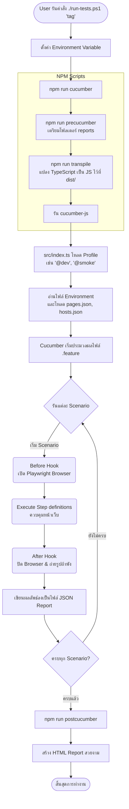
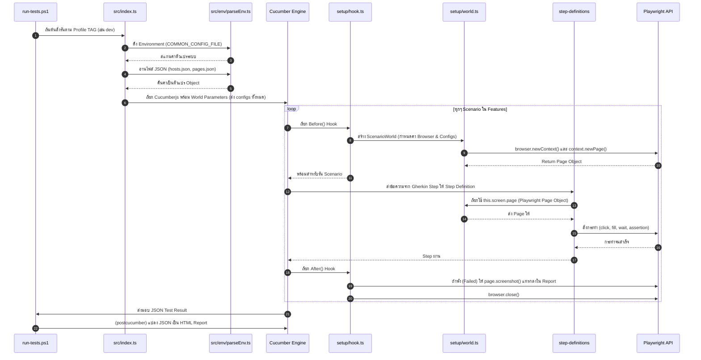

# สรุปภาพรวมและ Flow การทำงานของโปรเจค E2E Testing Framework

โปรเจคนี้เป็นระบบทดสอบอัตโนมัติ (Automated E2E Testing Framework) ซึ่งออกแบบให้รองรับการเขียนเทสต์แบบ BDD (Behavior-Driven Development) โดยเชื่อมโยงกับ Playwright สำหรับการควบคุมบราวเซอร์

## 🛠 เครื่องมือหลักที่ใช้ (Tech Stack)

- **Cucumber.js (BDD):** เครื่องมือรันเทสต์ที่พัฒนาด้วยหลักการ BDD ช่วยให้สามารถเขียนเทสต์เคสจากมุมมองของผู้ใช้งานได้ (Gherkin syntax เช่น Given, When, Then)
- **Playwright:** Engine หลักที่ใช้สั่งการและควบคุม Web Browser ในการจำลองคลิก, พิมพ์ หรืออ่านค่าจากหน้าเว็บ
- **TypeScript:** ภาษาโค้ดดิ้งหลักของระบบ ช่วยให้โครงสร้างมีความแข็งแรงและจับข้อผิดพลาดได้ก่อนรัน
- **Babel & ts-node:** เครื่องมือสำหรับการ Compile โค้ด TypeScript ไปเป็น JavaScript เพื่อให้ Node.js ทำงานได้
- **multiple-cucumber-html-reporter:** เครื่องมือสำหรับสร้างหน้าเว็บ HTML Report แจ้งผลลัพธ์การรันเทสต์ที่อ่านง่ายและสวยงาม

---

## 📂 โครงสร้างโปรเจคที่สำคัญ (Key Project Structure)

โครงสร้างลอจิกของ E2E Framework นี้ถูกจัดเก็บไว้ในโฟลเดอร์ `e2e` โดยมีศูนย์กลางอยู่ที่ `src`

- `package.json` เผื่อคำสั่งรันระบบ (เช่น `npm run cucumber`)
- `run-tests.ps1 / .sh` สคริปต์สำหรับเริ่มรันเทสต์ และส่ง Tag เข้าไป
- `cucumber.js` ไฟล์ตั้งค่า Configuration เริ่มต้นของ Cucumber (ชี้ไปที่โฟลเดอร์ `dist`)
- `src/features/` โฟลเดอร์สำหรับเก็บไฟล์ระดับ Business Requirement นามสกุล `.feature` (Gherkin)
- `src/step-definitions/` โฟลเดอร์โค้ด TypeScript ที่ทำหน้าที่ "จับคู่" กับ `.feature` ว่าในแต่ละ Step ต้องให้ Playwright ทำอะไร
  - มี `setup/hook.ts` และ `setup/world.ts` สำหรับเริ่มต้น Browser Context ของ Playwright ในแต่ละ Scenario
- `src/env/` ระบบจัดการ Development Environment (เช่น โหลด config ไฟล์ `.env`, `hosts.json`, `pages.json`)
- `src/reporter/` ระบบสร้าง HTML Report หลังจากเทสต์รันเสร็จสิ้น

---

## 🔄 Flow การทำงานทั้งหมด (Execution Flow)

การทำงานของระบบเริ่มตั้งแต่ผู้ใช้งานรันสคริปต์ ไปจนถึงการได้หน้าเว็บรายงานผล สรุปออกมาได้ดังแกนเวลาในรูปแบบแผนภาพด้านล่าง

### 1. แผนภาพรวมการทำงาน (High Level Flow)

### 2. แผนภาพการทำงานลึกระดับ Code (Technical Flow & Data Passing)

แผนภาพนี้อธิบายลำดับภาพพจน์ที่ Object สื่อสารกันในโค้ด (Sequence)

## 📝 อธิบายสเต็ปการรัน (Step-by-step summary)

1. **การตั้งค่าเริ่มต้น (Initialization):** เมื่อรัน `./run-tests.ps1 dev` สคริปต์จะชี้เป้า Environment Variable ไปที่ไฟล์ `env/common.env` ซึ่งระบุว่าจะต้องไปหาไฟล์ Config เส้นทางไหน (เช่น `hosts.json` และ `pages.json`)
2. **เตรียมไฟล์คอมไพล์ (Transpilation):** คำสั่ง `npm run cucumber` จะเรียกใช้คำสั่งย่อย `transpile` เพื่อล้างโฟลเดอร์เก่า (`dist`) ออก และใช้ Babel ในการสะกบโค้ด TypeScript ใน `src` เป็น JavaScript ให้พร้อมรัน
3. **โหลด Cucumber Config:** ระบบจะเรียก `index.ts` (ที่เพิ่งข้ามเป็น JS แล้ว) ขึ้นมา โดยมีหน้าที่อ่าน Config ไฟล์เตรียมแพ็กเกจเป็น Object เพื่อส่งให้ Cucumber เป็น `world-parameters` (ทำให้สามารถเรียกตัวแปร config เหล่านี้ได้ในทุก ๆ Step)
4. **เปิด Browser จำลอง (Hooks):** ก่อนที่แต่ละ Scenario จะเริ่มทำงาน ฟังก์ชันใน `src/step-definitions/setup/hook.ts` (Before) จะทำงานเพื่อเรียก Playwright เปิดหน้าเว็บ
5. **รันสเต็ป Playwright (Step Def):** Cucumber จับคู่บรรทัดในไฟล์ `.feature` กับ Regex ในไฟล์ TypeScript เมื่อตรงกัน ชุดคำสั่งใน Playwright ก็จะถูกใช้งานเพื่อโคลน Action ของมนุษย์
6. **ทำความสะอาด (Teardown):** เมื่อจบ Scenario (ไม่ว่าจะผ่านหรือผ่านร่วง) ตัว `hooks` จะถูกใช้อีกครั้ง (After) ถ้าเกิดเทสต์ไม่ผ่าน Playwright จะถ่ายรูปหน้าจออัตโนมัติแนบไว้ใน Report และสุดท้ายเพื่อปิดหน้า Browser ทิ้ง
7. **สรุปเป็นรีพอร์ต (Reporting):** สเต็ปสุดท้าย หากคำสั่งรัน Cucumber ทำงานเสร็จระบบจะทำ `postcucumber` ซึ่งเข้าไปรัน `cucumber-report.ts` ให้แปลงข้อมูล JSON Report ไปเป็น HTML สวยงาม ให้ผู้ใช้เปิดดูได้ในหน้าเบราเซอร์ (อยู่ในโฟลเดอร์ `reports/`)
